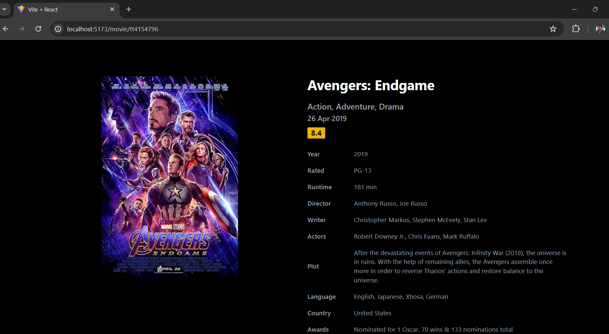

# Movie Search App

This is a movie search application built using React, Tailwind CSS, and Vite for the frontend, and Express.js and Node.js for the backend. The app allows users to search for movies by title and view detailed information about each movie. The data is fetched from the OMDb API.

## Features

- Search for movies by title
- View detailed information about each movie
- Responsive design using Tailwind CSS

## Technologies Used

- Frontend: React, Tailwind CSS, Vite
- Backend: Express.js, Node.js
- API: OMDb API

## Screenshots

### Home Page


### Movie Details


## Getting Started

### Prerequisites

- Node.js (v18 or later)
- npm (v7 or later)

### Installation

1. Clone the repository:
   ```bash
   git clone https://github.com/your-username/movie-search-app.git
   cd movie-search-app
