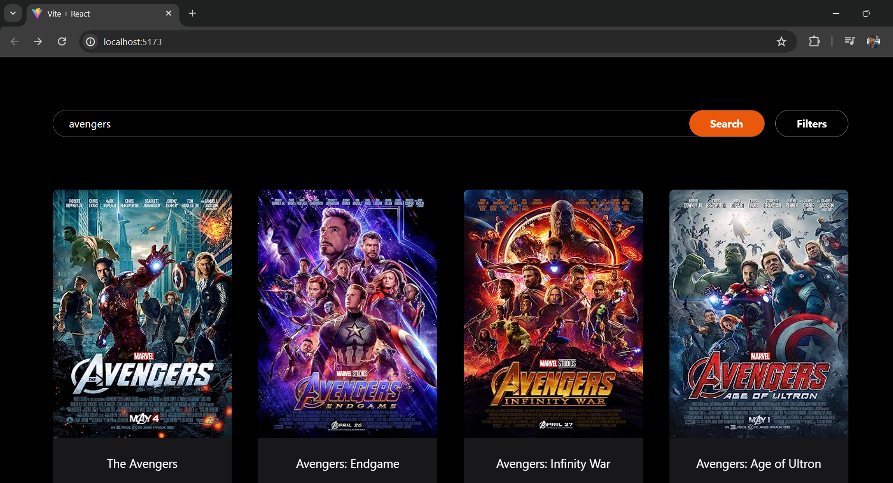

# Movie Search App

This is a movie search application built using React, Tailwind CSS, and Vite for the frontend, and Express.js and Node.js for the backend. The app allows users to search for movies by title and view detailed information about each movie. The data is fetched from the OMDb API.

## Features

- Search for movies by title
- View detailed information about each movie
- Responsive design using Tailwind CSS

## Technologies Used

- Frontend: React, Tailwind CSS, Vite
- Backend: Express.js, Node.js
- API: OMDb API

## Screenshots

### Home Page

### Movie Details

### Prerequisites

- Node.js (v18 or later)
- npm (v7 or later)

## Assumptions Made

- **API Key**: A valid OMDb API key is required. Replace `YOUR_OMDB_API_KEY` in the code with your actual key.
- **Data Structure**: The app assumes the OMDb API returns data as specified in their documentation.
- **Localhost Configuration**: The frontend runs on `http://localhost:5173` and the backend on `http://localhost:5000`. Ensure no port conflicts.
- **Network Requests**: The frontend sends requests to the local backend server. Make sure CORS is properly configured to allow these requests.

